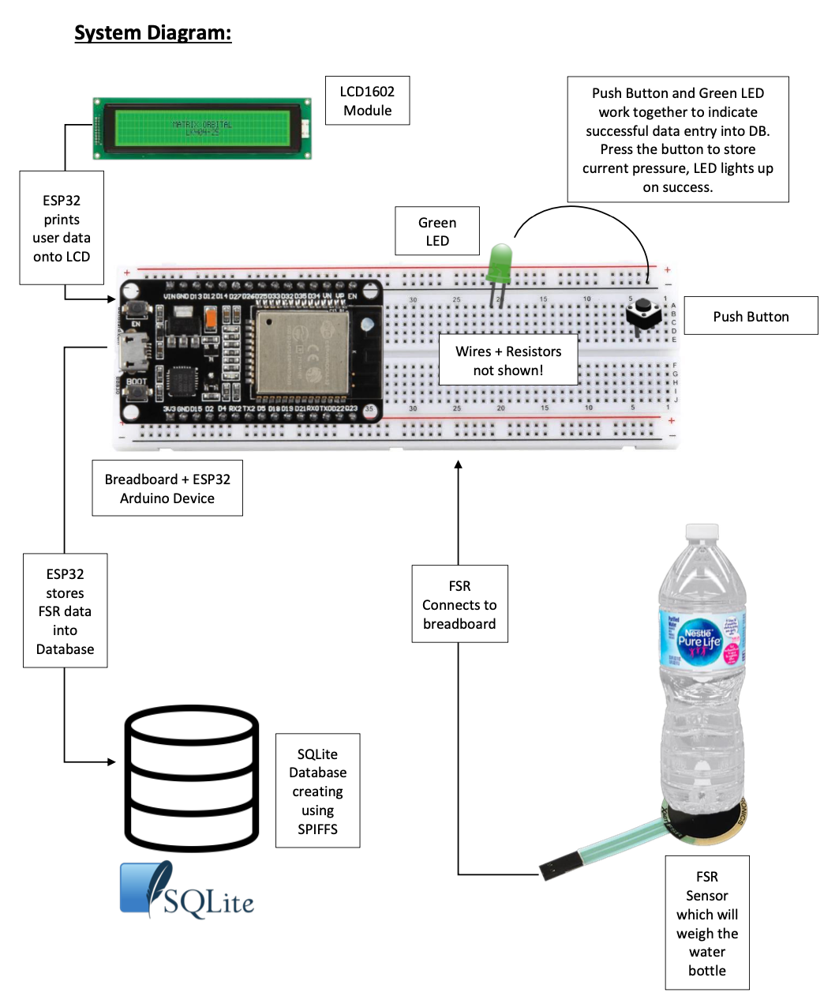

# IoT: Smart Water Bottle

 <!-- You can add an image of your project here -->

## Table of Contents

- [Introduction](#introduction)
- [Features](#features)
- [Getting Started](#getting-started)
  - [Prerequisites](#prerequisites)
  - [Installation](#installation)
- [Usage](#usage)
- [Contributing](#contributing)
- [License](#license)

## Introduction

The IoT Smart Water Bottle is a project designed to create a smart water bottle with various features to help users track their daily water intake. The project's goal is to encourage users to stay hydrated by providing reminders, tracking water consumption, and displaying the current water level in the bottle.

At the time of writing this document, the project is in its early stages, and only a subset of the intended features has been implemented in the Minimum Viable Product (MVP). The MVP allows users to measure water weight using a Force Sensitive Resistor (FSR) and display the measurement on an LCD screen. Users can also store their water intake data in an SQLite database for future reference.

## Features

The current MVP includes the following features:

- Measurement of water weight using an FSR
- Displaying water weight on an LCD screen
- Storing water intake data in an SQLite3 database

Future enhancements and planned features include:

- Daily water intake tracking
- Hourly water intake reminders
- Last water intake time tracking
- Real-time monitoring of the water level in the bottle

## Getting Started

### Prerequisites

To build and run this project, you will need the following components:

- Buttons
- Force Sensor Resistor (FSR)
- LCD1602 Module
- ESP32 Arduino Device
- LEDs
- Wires and Resistors

### Installation

For installation setup and hardware connection, see diagram above or read final report document.

## Usage

For functionality and usage, watch SmartWater.mp4

## Contributing

This project is closed. If you would like to make improvements, please reach out.

## License

This project is licensed under the MIT License.
